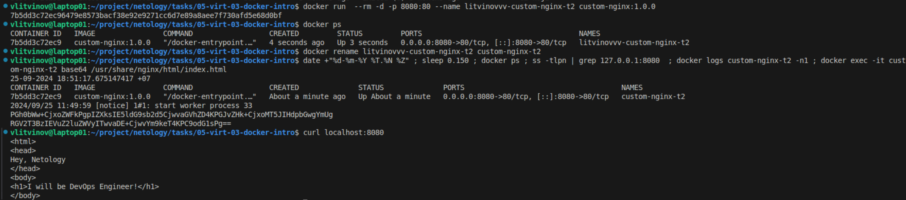
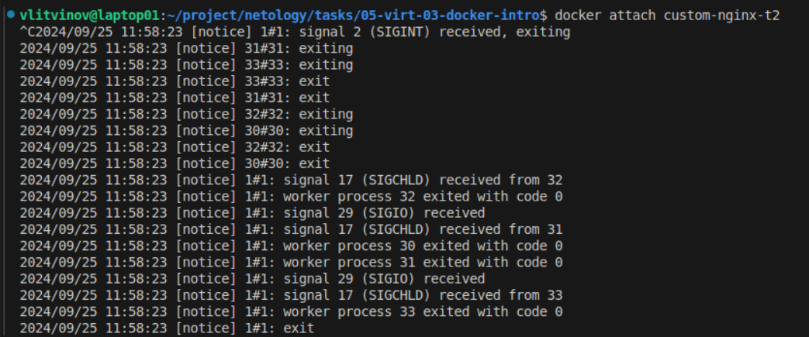
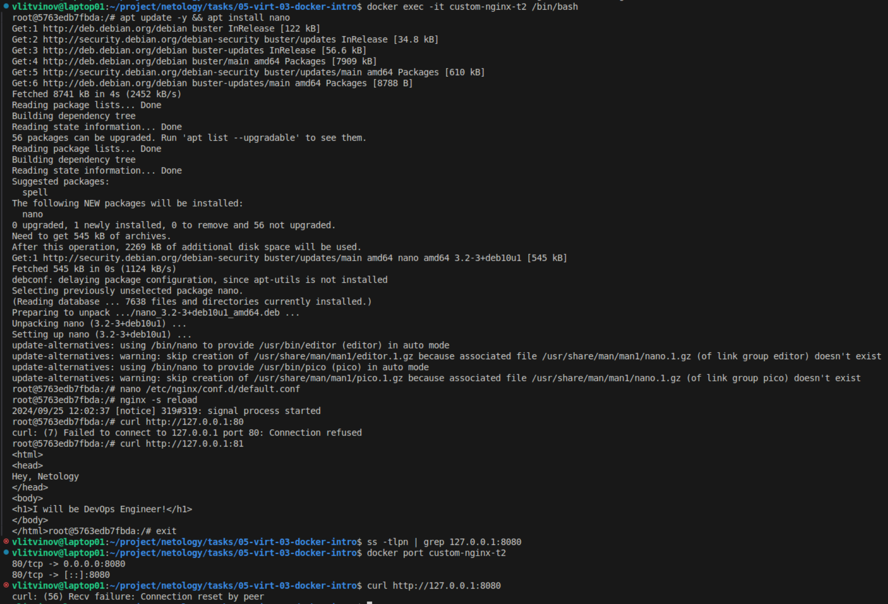
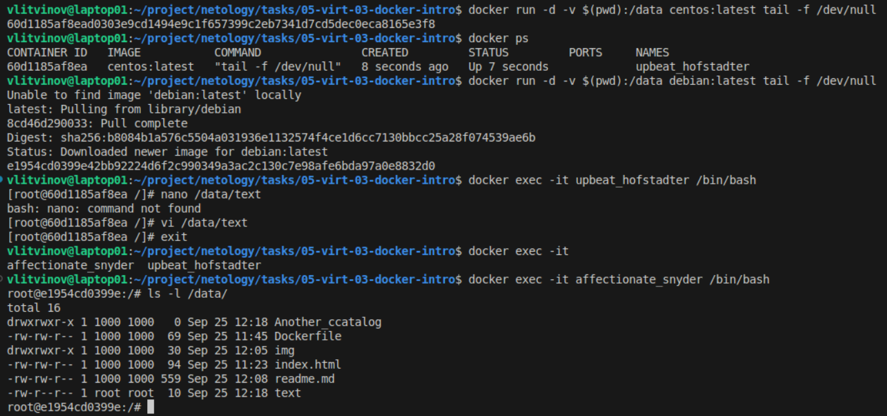
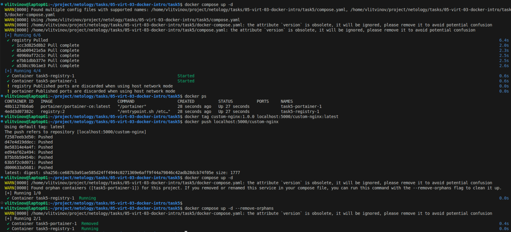
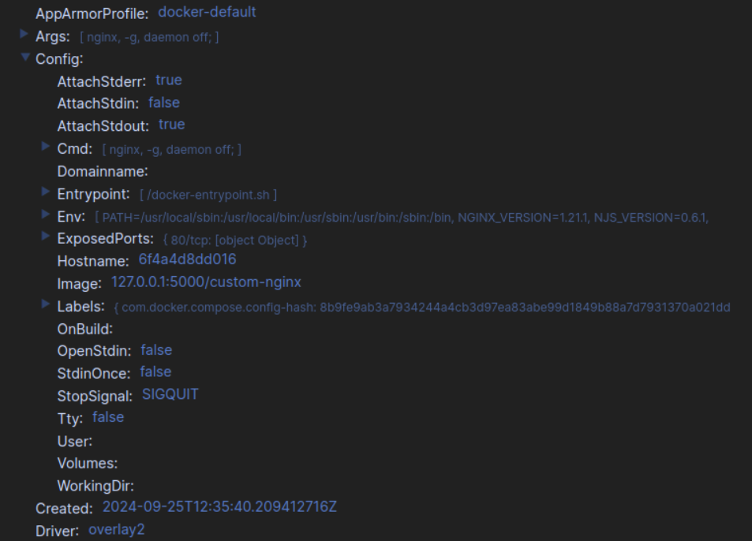

## Задача 1

https://hub.docker.com/r/ltvnvv/custom-nginx/tags


## Задача 2



## Задача 3

Контейнер остановился т.к. Ctrl+C остановил основой процесс контейнера.


Теперь nginx слушает на 81 порту, но контейнер по-прежнему маппит порт 8080 на 80

Удалить контейнер не останавливая его: ```docker rm --force custom-nginx-t2 ```

## Задача 4



## Задача 5

Был запущен compose.yaml, т.к. согласно документации он является приоритетным.



compose.yaml
```
include:
  - docker-compose.yaml 
services:
  portainer:
    image: portainer/portainer-ce:latest
    network_mode: host
    ports:
      - "9000:9000"
    volumes:
      - /var/run/docker.sock:/var/run/docker.sock
```


