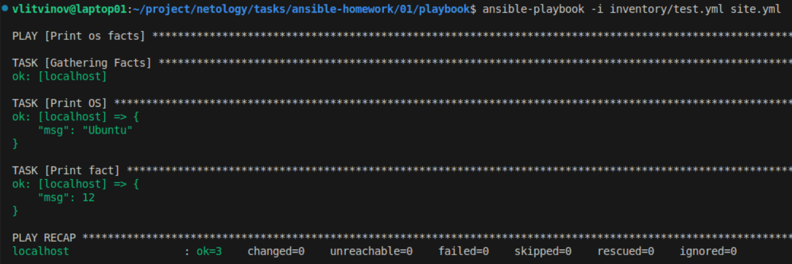
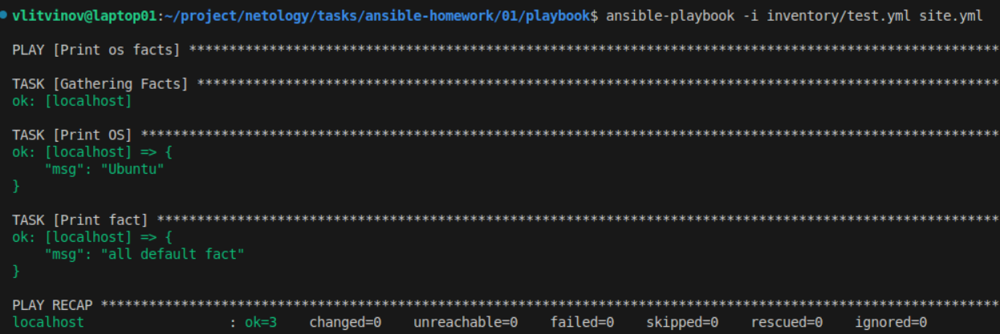
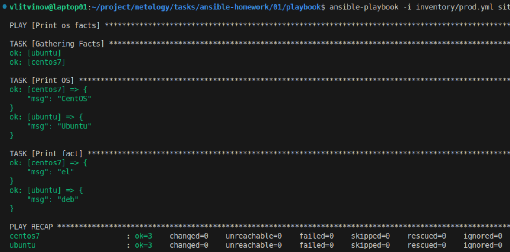
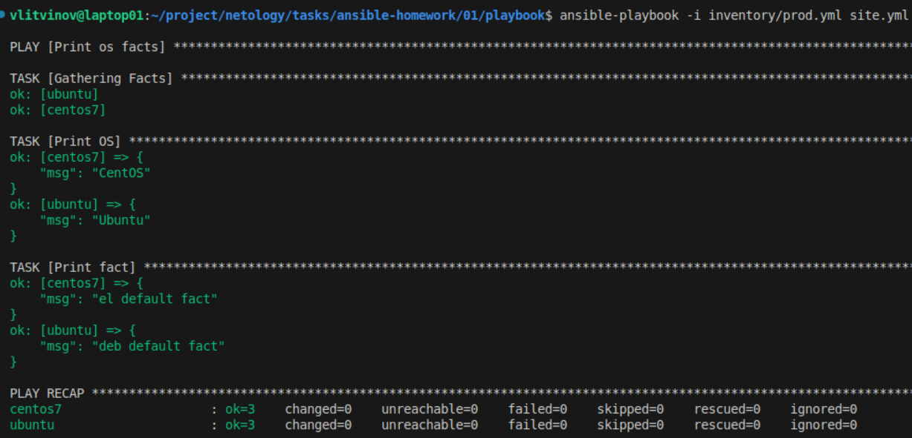
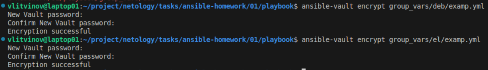
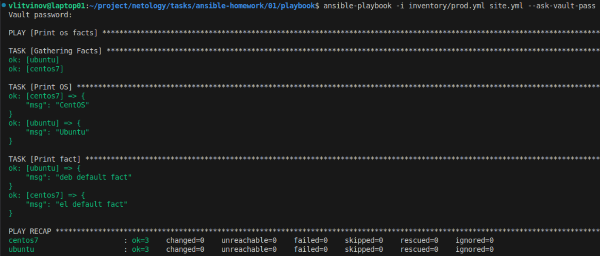
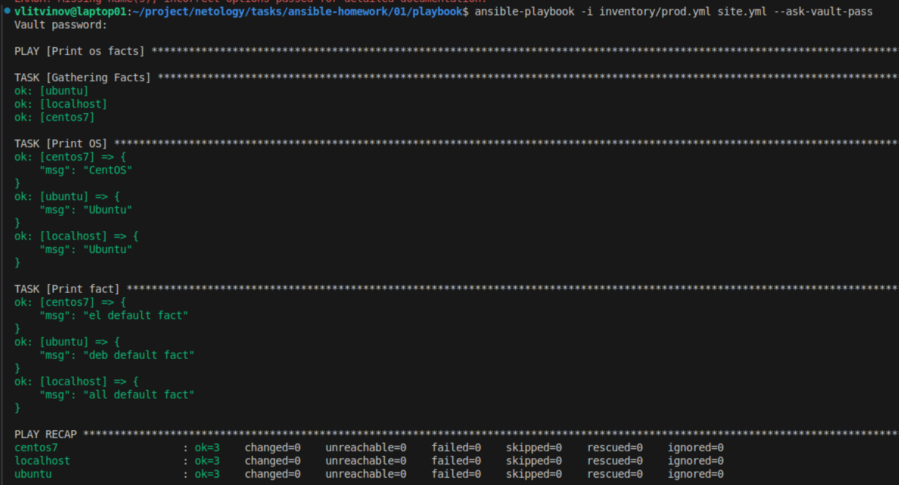

1. 
```
ansible-playbook -i inventory/test.yml site.yml
```


2. 


3. 
```
docker run -d --name centos7 centos:7 sleep infinity
docker run -d --name ubuntu ubuntu:latest sleep infinity
```
4. 
```
ansible-playbook -i inventory/prod.yml site.yml
```


6.  


7. 
```
ansible-vault encrypt group_vars/el/examp.yml
ansible-vault encrypt group_vars/deb/examp.yml
```


8. 
```
ansible-playbook -i inventory/prod.yml site.yml --ask-vault-pass
```


11. 
```
ansible-playbook -i inventory/prod.yml site.yml --ask-vault-pass
```

