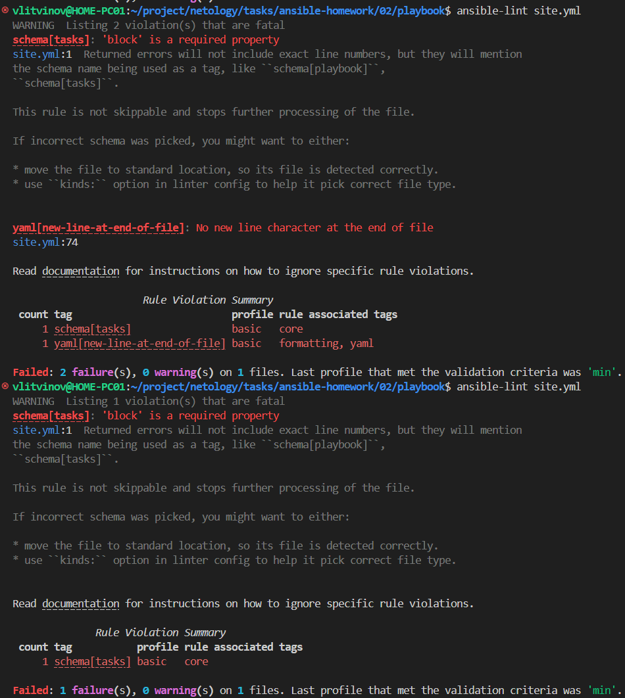
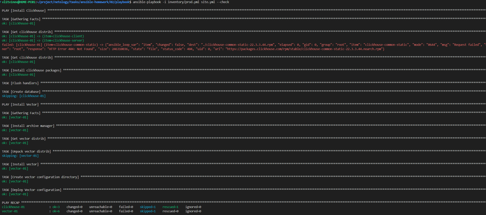
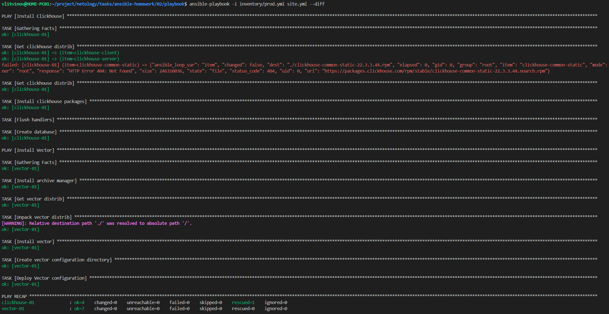
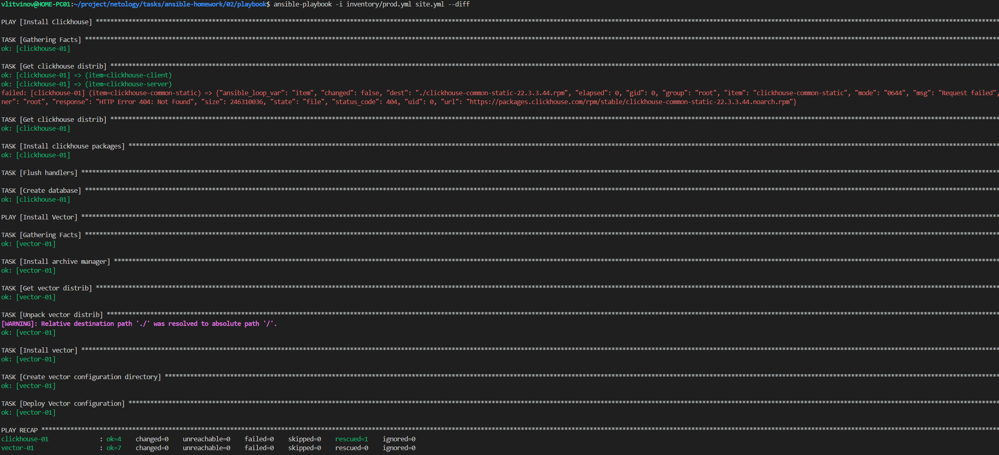

# Ansible Playbook для установки Clickhouse и Vector

Этот Ansible playbook предназначен для автоматической установки и настройки систем баз данных Clickhouse и Vector в docker-контейнерах.

## Описание

Playbook выполняет следующие задачи:

1. Play `Install Clickhouse` устанавливает и настраивает Clickhouse:
   - Загружает необходимые RPM-пакеты.
   - Устанавливает Clickhouse.
   - Создаёт базу данных "logs".
   - Запускает Clickhouse сервис.

2. Play `Install Vector`  устанавливает и настраивает Vector:
   - Загружает и распаковывает дистрибутив Vector.
   - Устанавливает исполняемый файл Vector.
   - Настраивает конфигурационную директорию и файл.

## Параметры
Параметры определяются с помощью переменных в директории `/playbook/group_vars/`
- `clickhouse_version`: Версия Clickhouse, которая будет установлена. (например, `21.9.3.30`).
- `clickhouse_packages`: Список пакетов Clickhouse, которые нужно загрузить и установить.
- `vector_version`: Версия Vector, которая будет установлена. (например, `0.14.0`).

Конфигурационный файл vector.yaml формируется на основе шаблона `vector_config.j2`

## Теги

- `clickhouse`: Используется для выполнения задач, связанных с установкой и настройкой Clickhouse.
- `vector`: Используется для выполнения задач, связанных с установкой и настройкой Vector.

## Использование

1. Запустить docker-контейнеры
```bash
docker run -d -p 9000:9000 --name clickhouse-01 centos:7 sleep infinity
docker run -d --name vector-01 centos:7 sleep infinity
```
3. Запустите playbook с помощью команды:

```bash
ansible-playbook -i inventory/prod.yml site.yml
```

## Скриншоты к задания 5-8:



