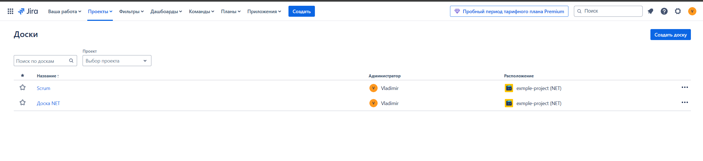
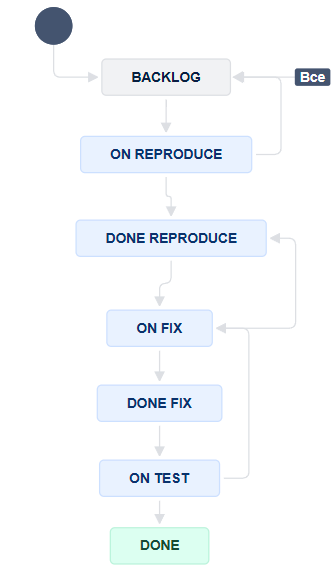
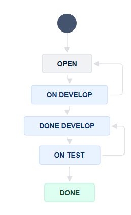
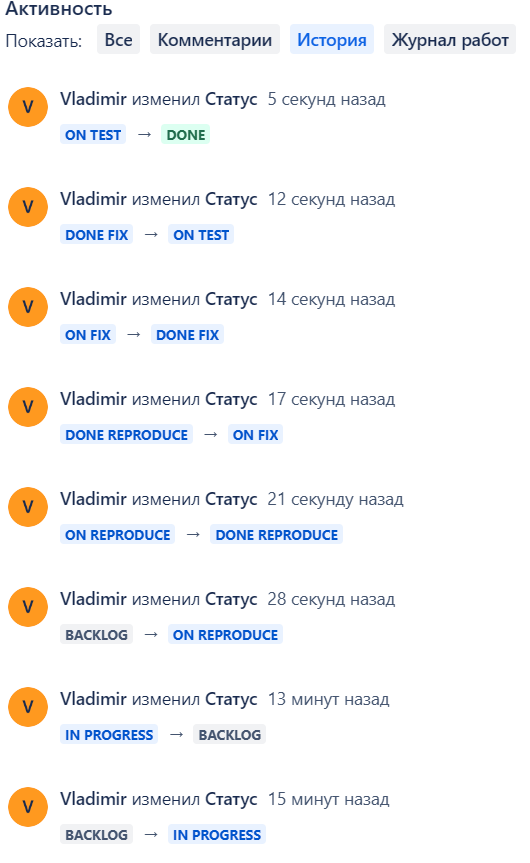
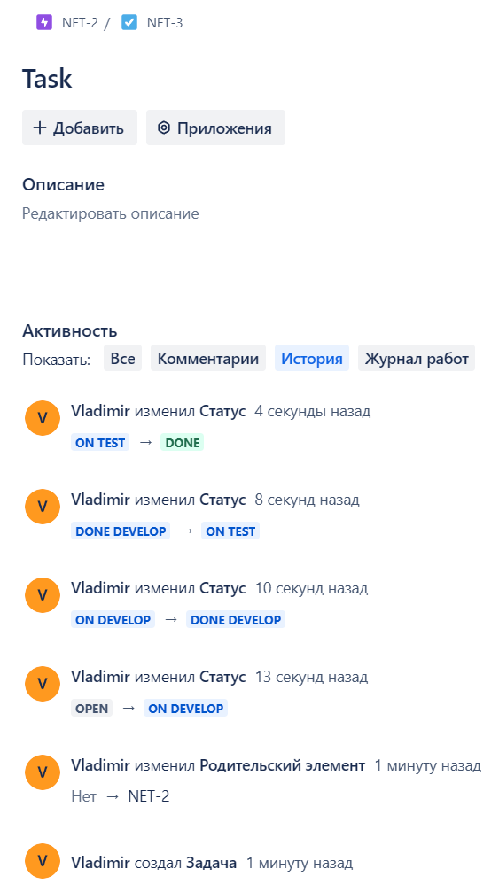
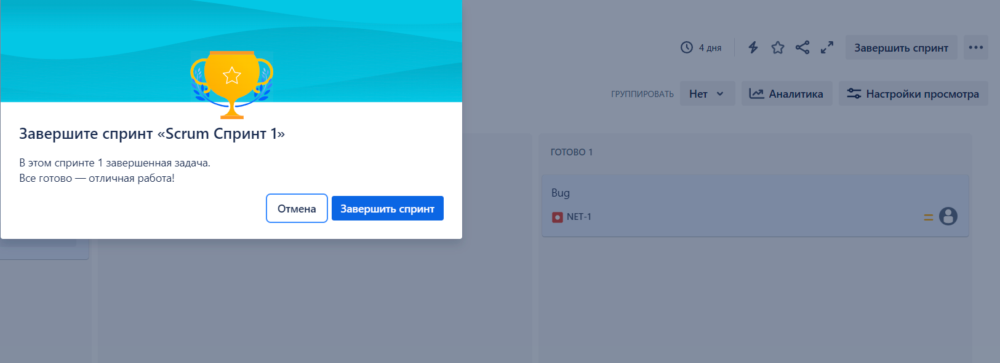

### Задание 1

Создан аккаунт на https://www.atlassian.com/ru/software/jira/work-management/free. Создан новый проект из шаблона Kanban.

Создана дополнительная доска для scrum.

Workflow для Bug

Workflow для остальных задача

Завершенный процесс для Bug

Завершенный процесс для Taks в Epic

Завершенный спринт 

Файлы с workflow в формате xml лежат в директории Workflows.
