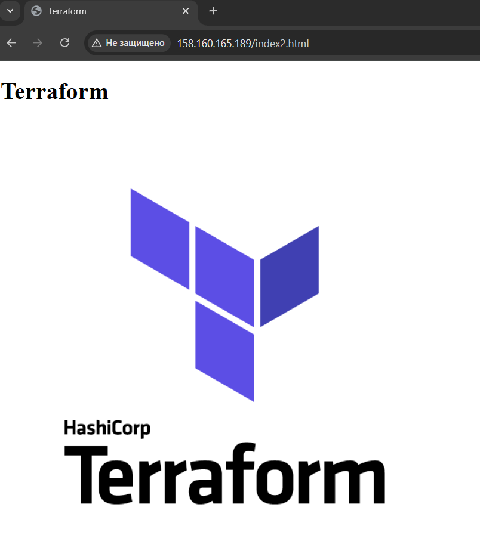

## Задание 1. Yandex Cloud 

**Что нужно сделать**

1. Создать бакет Object Storage и разместить в нём файл с картинкой:

 - Создать бакет в Object Storage с произвольным именем (например, _имя_студента_дата_).

Согласно документации для создания Terraform взаимодействует с Object Storage от имени сервисного аккаунта. Поэтому сначала создадим сервисный аккаунт, назначить роль и получить токен:
```terraform
resource "yandex_iam_service_account" "lv-sa" {
  name = "lv-sa"
}

resource "yandex_resourcemanager_folder_iam_member" "lv-sa-editor" {
  folder_id = var.folder_id
  role      = "storage.editor"
  member    = "serviceAccount:${yandex_iam_service_account.lv-sa.id}"
}

resource "yandex_iam_service_account_static_access_key" "lv-sa-static-key" {
  service_account_id = yandex_iam_service_account.lv-sa.id
  description        = "static access key for object storage"
}

resource "yandex_storage_bucket" "lv-20250321" {
  access_key = yandex_iam_service_account_static_access_key.lv-sa-static-key.access_key
  secret_key = yandex_iam_service_account_static_access_key.lv-sa-static-key.secret_key
  bucket = "lv-20250321"
}
```

 - Положить в бакет файл с картинкой.
  - Сделать файл доступным из интернета.

```terraform
resource "yandex_storage_object" "lv-picture" {
  access_key = yandex_iam_service_account_static_access_key.lv-sa-static-key.access_key
  secret_key = yandex_iam_service_account_static_access_key.lv-sa-static-key.secret_key
  bucket = yandex_storage_bucket.lv-20250321.bucket
  key    = "terraform-logo"
  content_type = "image/png"
  source = "./img/terraform-logo.png"
  acl = "public-read"
}
```
 
2. Создать группу ВМ в public подсети фиксированного размера с шаблоном LAMP и веб-страницей, содержащей ссылку на картинку из бакета:

```terraform
resource "yandex_compute_instance_group" "group1" {
  name                = "test-ig"
  folder_id           = var.folder_id
  service_account_id  = yandex_iam_service_account.lv-sa.id

  depends_on = [
    yandex_resourcemanager_folder_iam_member.lv-global-editor,
    yandex_resourcemanager_folder_iam_member.lv-vpc-user
  ]

  deletion_protection = false

  instance_template {
    platform_id = "standard-v1"

    resources {
      memory = 2
      cores  = 2
    }

    boot_disk {
      mode = "READ_WRITE"
      initialize_params {
        image_id = "fd827b91d99psvq5fjit"
        size     = 10
      }
    }

    network_interface {
      network_id = yandex_vpc_network.network-vpc.id
      subnet_ids = ["${yandex_vpc_subnet.public.id}"]
    }

    metadata = {
      ssh-keys = "ubuntu:${file("~/.ssh/id_rsa.pub")}"
      user-data = file("./cloud-config.yaml")
    }

  }

  scale_policy {
    fixed_scale {
      size = 3
    }
  }

  allocation_policy {
    zones = ["ru-central1-a"]
  }

  health_check {
    interval = 5
    timeout = 3
    healthy_threshold = 2
    unhealthy_threshold = 2
    http_options {
      path = "/index.html"
      port = 80
    }
  }

  deploy_policy {
    max_expansion   = 0
    max_unavailable = 1
  }

}
```

 - Создать Instance Group с тремя ВМ и шаблоном LAMP. Для LAMP рекомендуется использовать `image_id = fd827b91d99psvq5fjit`.

```terraform
  scale_policy {
    fixed_scale {
      size = 3
    }
  }
```

 - Для создания стартовой веб-страницы рекомендуется использовать раздел `user_data` в [meta_data](https://cloud.yandex.ru/docs/compute/concepts/vm-metadata).

```terraform
    metadata = {
      ssh-keys = "ubuntu:${file("~/.ssh/id_rsa.pub")}"
      user-data = file("./cloud-config.yaml")
    }
```

 - Разместить в стартовой веб-странице шаблонной ВМ ссылку на картинку из бакета.
 - Настроить проверку состояния ВМ.

 ```terraform
  health_check {
    interval = 5
    timeout = 3
    healthy_threshold = 2
    unhealthy_threshold = 2
    http_options {
      path = "/index.html"
      port = 80
    }
  }
 ```
 
3. Подключить группу к сетевому балансировщику:

 - Создать сетевой балансировщик.

```terraform
resource "yandex_lb_target_group" "lv-lamp-balancer-group" {
  name      = "lv-lamp-balancer-group"
  region_id = "ru-central1"

  target {
    subnet_id = yandex_vpc_subnet.public.id
    address   = yandex_compute_instance_group.group1.instances[0].network_interface[0].ip_address
  }

  target {
    subnet_id = yandex_vpc_subnet.public.id
    address   = yandex_compute_instance_group.group1.instances[1].network_interface[0].ip_address
  }

  target {
    subnet_id = yandex_vpc_subnet.public.id
    address   = yandex_compute_instance_group.group1.instances[2].network_interface[0].ip_address
  }
}

resource "yandex_lb_network_load_balancer" "lv-lamp-balancer" {
  name = "lv-lamp-balancer"

  listener {
    name = "lv-lamp-balancer-listener"
    port = 80
    external_address_spec {
      ip_version = "ipv4"
    }
  }

  attached_target_group {
    target_group_id = yandex_lb_target_group.lv-lamp-balancer-group.id
    healthcheck {
      name = "lv-lamp-balancer-healthcheck"
      http_options {
        port = 80
        path = "/index2.html"
      }
    }
  }
}
```

 - Проверить работоспособность, удалив одну или несколько ВМ.


