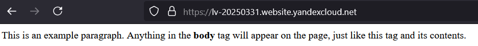

## Задание 1. Yandex Cloud   

1. С помощью ключа в KMS необходимо зашифровать содержимое бакета:

 - создать ключ в KMS;

```terraform
resource "yandex_kms_symmetric_key" "lv-cipher-key" {
  name = "lv-cipher-key"
}
```

 - с помощью ключа зашифровать содержимое бакета, созданного ранее.

Для шифрования содержимого бакета необходима добавить секцию в ресурс resource "yandex_storage_bucket" "lv-20250321":

```terraform
  server_side_encryption_configuration {
    rule {
      apply_server_side_encryption_by_default {
        kms_master_key_id = yandex_kms_symmetric_key.lv-cipher-key.id
        sse_algorithm     = "aws:kms"
      }
    }
  }
```

2. (Выполняется не в Terraform)* Создать статический сайт в Object Storage c собственным публичным адресом и сделать доступным по HTTPS:

 - создать сертификат;
 - создать статическую страницу в Object Storage и применить сертификат HTTPS;
 - в качестве результата предоставить скриншот на страницу с сертификатом в заголовке (замочек).

В бакет необходимо загрузить файлы static/index.html и static/error.html


