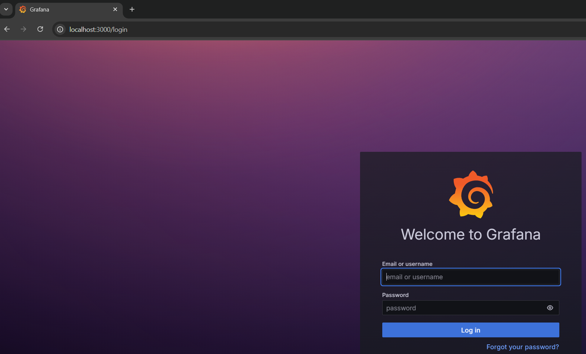
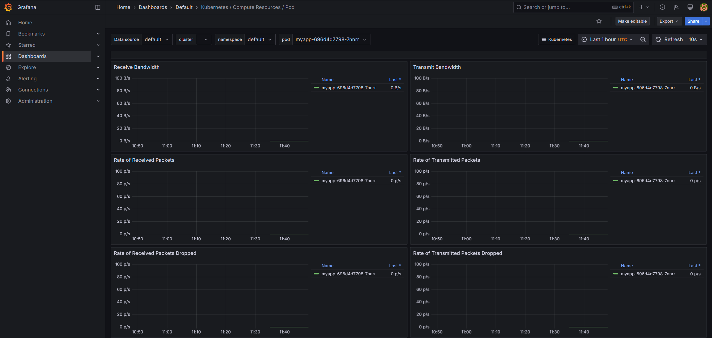
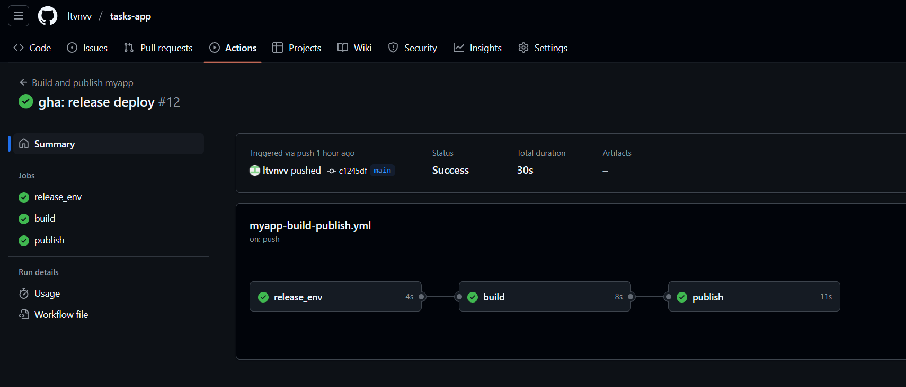
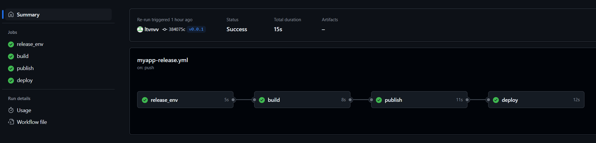
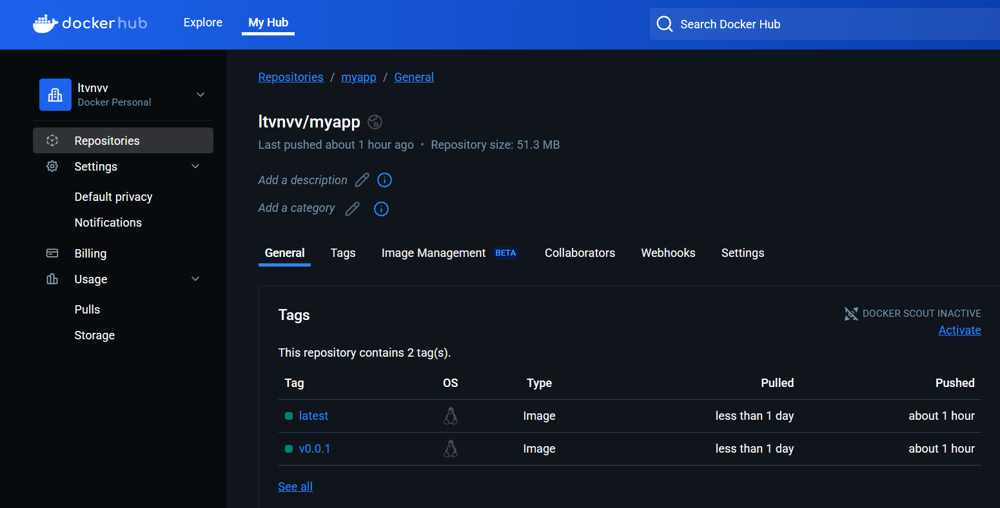

Дипломная работа профессии "DevOps-инженер"
---

Целями данной работы являются:

- Подготовить облачную инфраструктуру на базе облачного провайдера Яндекс.Облако.
- Запустить и сконфигурировать Kubernetes кластер.
- Установить и настроить систему мониторинга.
- Настроить и автоматизировать сборку тестового приложения с использованием Docker-контейнеров.
- Настроить CI для автоматической сборки и тестирования.
- Настроить CD для автоматического развёртывания приложения.

## 1 Создание облачной инфраструктуры

В разделе 1 описаны подготовительные действия необходимые для установки и запуска Kubernetes кластера в облачном провайдере Yandex.Cloud

### 1.1 Создание сервисного аккаунта

Для создания сервисного аккаунта необходимо выполнить действия, описанные в [документации](https://yandex.cloud/ru/docs/iam/quickstart-sa).

### 1.2 Создание S3-бакета для хранения terraform-backend

Для создания S3-бакета воспользуемся Terraform'ом. В каталоге 1.terraform-prepare создадим файлы main.tf, в котором опишем настройки для terraform-провайдера. 

```terraform
terraform {
  required_providers {
    yandex = {
      source = "yandex-cloud/yandex"
    }
  }
  required_version = ">= 0.13"
}

provider "yandex" {
  token     = var.token
  cloud_id  = var.cloud_id
  folder_id = var.folder_id
  zone      = "ru-central1-a"
}
```

Создадим файл personal.auto.tfvars, для хранения чувствительных данных и добавим его в .gitignore. В git-репозитории разместим файл personal.auto.tfvars.example.

Проинициализируем terraform командой:

```sh
cd tasks/diploma/1.terrafrom-prepare
terraform init
```

Создадим object_storage.tf, в котором опишем создание S3-бакета для хранения terraform-backend.

```terraform
resource "yandex_storage_bucket" "tf-backend-lv" {
  bucket = "tf-backend-lv"
  folder_id = var.folder_id
}
```

Провалидируем terraform-манифест и создадим ресурсы:

```sh 
terraform validate
terraform apply
```

### 1.3 Создание конфигурации Terraform

Перейдём в Identity and Access Management и получим новый ключ доступа к S3. Внесём их в ~/.aws/credentials в профиль diploma. Затем добавим роль Editor в бакет для сервисного аккаунта. Создадим каталог diploma в бакете.

Выполним инициализацию terraform

```sh
cd tasks/diploma/2.terraform
terraform init
```

### 1.4 Создание VPC с подсетями в разных зонах доступности

Создадим файл network.tf и применим terraform-манифест

```terraform
resource "yandex_vpc_network" "network-vpc" {
  name = "network-vpc"
}

resource "yandex_vpc_subnet" "subnet-a" {
  name = "subnet-a"
  zone = "ru-central1-a"
  network_id = yandex_vpc_network.network-vpc.id
  v4_cidr_blocks = ["192.168.10.0/24"]
}
...
```

## 2 Создание Kubernetes кластера

Добавим в variables.tf переменную sa_id с идентификатором сервисного аккаунта. Создадим манифест kubernetes-master.tf и kubernetes-node.tf. После чего применим манифесты:

```sh
cd tasks/diploma/2.terraform
terraform apply
```

Чтобы получить доступ к кластеру воспользуемся утилитой yc:
```sh
yc managed-kubernetes cluster \
   get-credentials diploma-cluster \
   --external
```

## 3 Создание тестового приложения

Создан репозиторий [tasks-app](https://github.com/ltvnvv/tasks-app/) с тестовым приложением. Dockerfile для сборки приложения расположен в tasks-app/.docker/Dockerfile. Собранные образы хранятся в [DockerHub Registry](https://hub.docker.com/r/ltvnvv/myapp/tags).


## 4 Подготовка системы мониторинга и деплой приложения

### 4.1 Деплой системы мониторинга

Для настройки мониторинга Kubernetes-кластера воспользуемся [kube-prometheus](https://github.com/prometheus-operator/kube-prometheus). Скачаю в свой репозиторий директорию manifests.

```sh
cd tasks/diploma/4.monitoring
kubectl apply --server-side -f manifests/setup
kubectl wait \
	--for condition=Established \
	--all CustomResourceDefinition \
	--namespace=monitoring
kubectl apply -f manifests/
```
Выполним Port-Forward и убедимся, что есть доступ к Grafana:
```sh
kubectl port-forward pods/grafana-*** 3000:3000
```





## 5 Установка и настройка CI/CD

Для удобства в Github Action был развёрнут собственный раннер, на который был установлен Docker:
```sh
mkdir actions-runner && cd actions-runner
curl -o actions-runner-linux-x64-2.323.0.tar.gz -L https://github.com/actions/runner/releases/download/v2.323.0/actions-runner-linux-x64-2.323.0.tar.gz
echo "0dbc9bf5a58620fc52cb6cc0448abcca964a8d74b5f39773b7afcad9ab691e19  actions-runner-linux-x64-2.323.0.tar.gz" | shasum -a 256 -c
./config.sh --url https://github.com/ltvnvv/tasks-app --token <token>

for pkg in docker.io docker-doc docker-compose docker-compose-v2 podman-docker containerd runc; do sudo apt-get remove $pkg; done

# Add Docker's official GPG key:
sudo apt-get update
sudo apt-get install ca-certificates curl
sudo install -m 0755 -d /etc/apt/keyrings
sudo curl -fsSL https://download.docker.com/linux/ubuntu/gpg -o /etc/apt/keyrings/docker.asc
sudo chmod a+r /etc/apt/keyrings/docker.asc

# Add the repository to Apt sources:
echo \
  "deb [arch=$(dpkg --print-architecture) signed-by=/etc/apt/keyrings/docker.asc] https://download.docker.com/linux/ubuntu \
  $(. /etc/os-release && echo "${UBUNTU_CODENAME:-$VERSION_CODENAME}") stable" | \
  sudo tee /etc/apt/sources.list.d/docker.list > /dev/null
sudo apt-get update

sudo apt-get install docker-ce docker-ce-cli containerd.io docker-buildx-plugin docker-compose-plugin

sudo usermod -aG docker $USER
newgrp docker

./run.sh
```

### 5.1 Автоматическая сборка docker образа при коммите в репозиторий с тестовым приложением
В GitHub репозиторий с приложением myapp необходимо добавить Variables:  
IMAGE_NAME: ltvnvv/myapp

В GitHub репозиторий с приложением myapp необходимо добавить Secrets:  
REGISTRY_USERNAME: <docker hub login>  
REGISTRY_PASSWORD: <docker hub password>

Для автоматической сборки приложения в Docker-образ и публикации его в Docker Registry был написан GitHub Action Workflow [myapp-build-publish.yml](https://github.com/ltvnvv/tasks-app/blob/main/.github/workflows/myapp-build-publish.yml). Workflow запускается при коммите в main-ветку.



### 5.2 Автоматический деплой нового docker образа.

Для сборки и публикации приложения в Docker Registry по тегу был написан GitHub Action Workflow [myapp-build-publish.yml](https://github.com/ltvnvv/tasks-app/blob/main/.github/workflows/myapp-release.yml).



На скриншоте ниже представлен DockerHub Registry с опубликованными образами приложения myapp с тегами latest и v0.0.1



Для деплоя тестового приложения написан YML-манифест [deployment.yml](https://github.com/ltvnvv/tasks-app/blob/main/k8s/deployment.yml).

В GitHub репозиторий с приложением myapp необходимо добавить Secrets:
KUBE_CONFIG: <cat ~/.kube/config>


После деплоя приложения можем перейти по адресу кластера http://<ip_address>:30080 и убедиться, что приложение работает. 


Как видно из скриншотов, представленных выше, приложение успешно собирается и публикуется в Docker Registry. А также деплоится в Kubernetes кластер.

## Выводы

В ходе проделанной работы были достигнуты следующие цели:
- Развёрнута облачная инфраструктура в Yandex.Cloud с использованием Terraform, включая:
  - Создание VPC и подсетей в разных зонах доступности;
  - Настройку S3-бакета для хранения состояния Terraform;
  - Автоматизированное управление ресурсами через IaC.
- Развёрнут и настроен Kubernetes-кластер;
- Внедрена система мониторинга на базе kube-prometheus (Prometheus + Grafana), что дало возможность отслеживать состояние кластера и приложения в реальном времени;
- Реализован CI/CD-процесс с использованием GitHub Actions, включающий:
  - Автоматическую сборку Docker-образов при изменениях в коде;
  - Публикацию образов в Docker Hub;
  - Деплой приложения в Kubernetes по тегам.
- Тестовое приложение успешно развёрнуто в кластере и доступно через внешний IP-адрес, что подтверждает корректность настройки всей инфраструктуры.
