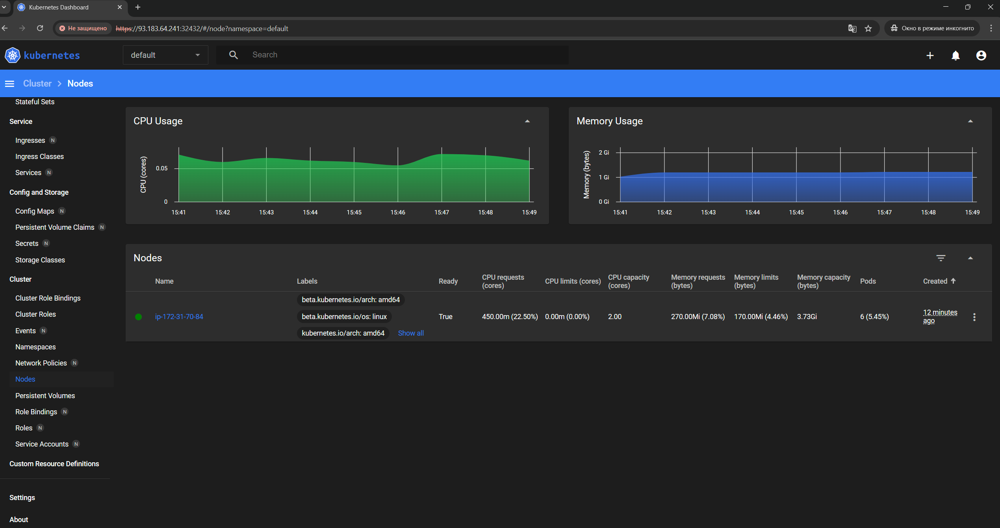

### Задание 1. Установка MicroK8S

1. Установить MicroK8S на локальную машину или на удалённую виртуальную машину.
```sh
sudo apt update
sudo apt install snapd
sudo snap install microk8s --classic
sudo usermod -a -G microk8s $USER
sudo chown -f -R $USER ~/.kube
```
Убедился, что microk8s установлен и функционирует
```sh
microk8s status --wait-ready
```

2. Установить dashboard.
```sh
microk8s enable dashboard
```
3. Сгенерировать сертификат для подключения к внешнему ip-адресу.
Отредактировал файл /var/snap/microk8s/current/certs/csr.conf.template
```sh
[ alt_names ]
# Add
IP.4 = 123.45.67.89
```
```sh
sudo microk8s refresh-certs --cert front-proxy-client.crt
```

4. Получил токен для подключения к dashboard
```sh
microk8s kubectl -n kube-system get secret
microk8s kubectl -n kube-system get secret microk8s-dashboard-token -o jsonpath='{.data.token}' | base64 --decode
```
5. Настроил доступ к dashboard
Изменил тип сервиса с `type: ClusterIP` на `type: NodePort`.
```sh
microk8s kubectl -n kube-system edit service kubernetes-dashboard
```
Получил порт для dashboard
```sh
microk8s kubectl -n kube-system get service kubernetes-dashboard
```

------

### Задание 2. Установка и настройка локального kubectl
1. Установить на локальную машину kubectl.
```sh
curl -LO https://storage.googleapis.com/kubernetes-release/release/`curl -s https://storage.googleapis.com/kubernetes-release/release/stable.txt`/bin/linux/amd64/kubectl
chmod +x ./kubectl
sudo mv ./kubectl /usr/local/bin/kubectl
bash source <(kubectl completion bash)
echo "source <(kubectl completion bash)" >> ~/.bashrc
```
2. Настроить локально подключение к кластеру.
```sh
microk8s config
mkdir ~/.kube
vim ~/.kube/config
kubectl get nodes
```


3. Подключиться к дашборду с помощью port-forward.

------

