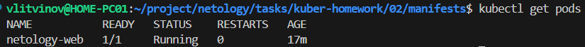
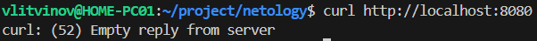
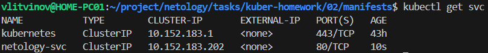
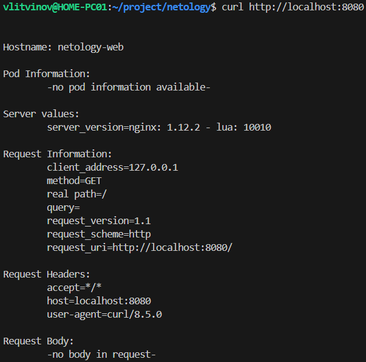

### Задание 1. Создать Pod с именем hello-world

1. Создать манифест (yaml-конфигурацию) Pod.

[pod.yaml](manifests/pod.yaml)

2. Использовать image - gcr.io/kubernetes-e2e-test-images/echoserver:2.2.
3. Подключиться локально к Pod с помощью `kubectl port-forward` и вывести значение (curl или в браузере).
```sh
kubectl create -f pod.yaml
kubectl port-forward netology-web 8080:80
kubectl get pods
```




------

### Задание 2. Создать Service и подключить его к Pod

1. Создать Pod с именем netology-web.
2. Использовать image — gcr.io/kubernetes-e2e-test-images/echoserver:2.2.
3. Создать Service с именем netology-svc и подключить к netology-web.

[svc.yaml](manifests/svc.yaml)

4. Подключиться локально к Service с помощью `kubectl port-forward` и вывести значение (curl или в браузере).

```sh
kubectl create -f svc.yaml
kubectl get svc
kubectl port-forward svc/netology-svc 8080:80
```





------

