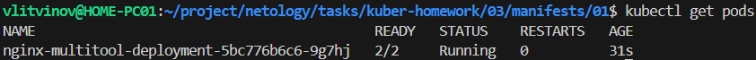
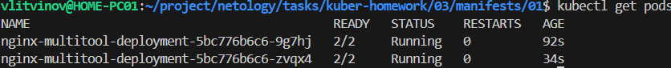
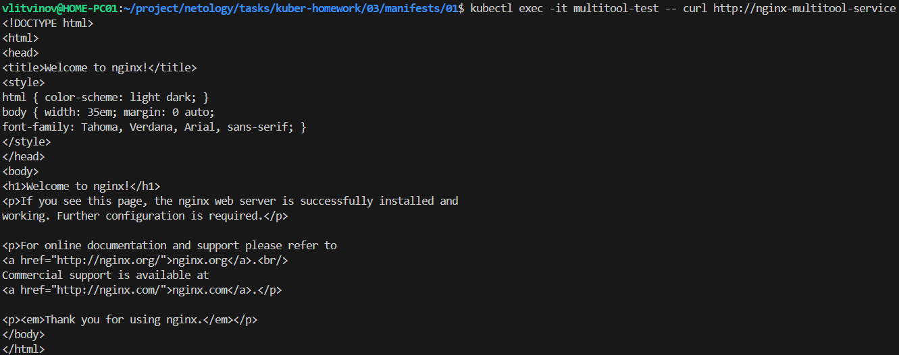
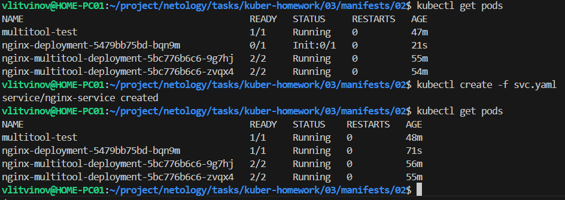

### Задание 1. Создать Deployment и обеспечить доступ к репликам приложения из другого Pod

1. Создать Deployment приложения, состоящего из двух контейнеров — nginx и multitool. Решить возникшую ошибку.

[deployment.yaml](manifests/01/deployment.yaml)

```sh
kubectl create -f deployment.yaml
kubectl logs nginx-multitool-deployment-6fd4f6786d-25bt7 -c nginx
```

2. После запуска увеличить количество реплик работающего приложения до 2.

```sh
kubectl scale deployment nginx-multitool-deployment --replicas=2
```

3. Продемонстрировать количество подов до и после масштабирования.





4. Создать Service, который обеспечит доступ до реплик приложений из п.1.

[svc.yaml](manifests/01/svc.yaml)

```sh
kubectl create -f svc.yaml
```

5. Создать отдельный Pod с приложением multitool и убедиться с помощью `curl`, что из пода есть доступ до приложений из п.1.

[pod.yaml](manifests/01/pod.yaml)

```sh
kubectl create -f pod.yaml
kubectl exec -it multitool-test -- curl http://nginx-multitool-service
```



------

### Задание 2. Создать Deployment и обеспечить старт основного контейнера при выполнении условий

1. Создать Deployment приложения nginx и обеспечить старт контейнера только после того, как будет запущен сервис этого приложения.

[deployment.yaml](manifests/02/deployment.yaml)

2. Убедиться, что nginx не стартует. В качестве Init-контейнера взять busybox.
3. Создать и запустить Service. Убедиться, что Init запустился.

[svc.yaml](manifests/02/svc.yaml)

```sh
kubectl create -f svc.yaml
kubectl get pods 
```

4. Продемонстрировать состояние пода до и после запуска сервиса.



------
