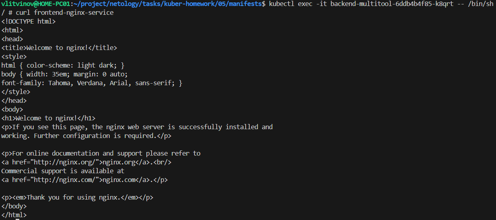
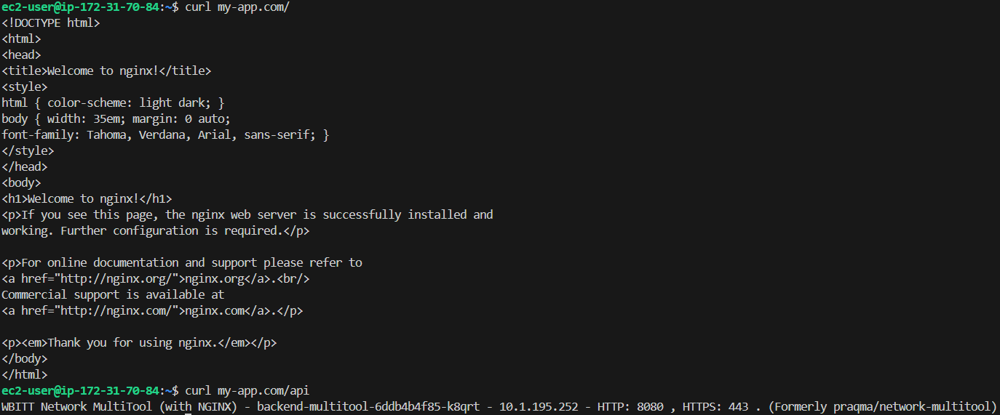

### Задание 1. Создать Deployment приложений backend и frontend

1. Создать Deployment приложения _frontend_ из образа nginx с количеством реплик 3 шт.
2. Создать Deployment приложения _backend_ из образа multitool. 
3. Добавить Service, которые обеспечат доступ к обоим приложениям внутри кластера.

```sh
kubectl apply -f deployment_fe.yaml 
kubectl apply -f deployment_be.yam
kubectl apply -f svc_fe.yml 
kubectl apply -f svc_be.yml 
```

4. Продемонстрировать, что приложения видят друг друга с помощью Service.

```sh
kubectl exec -it backend-multitool-6ddb4b4f85-k8qrt -- /bin/sh
curl frontend-nginx-service
```

5. Предоставить манифесты Deployment и Service в решении, а также скриншоты или вывод команды п.4.



[deployment_be.yaml](manifests/05/deployment_be.yaml)

[deployment_fe.yaml](manifests/05/deployment_fe.yaml)

[svc_be.yml](manifests/05/svc_be.yml)

[svc_fe.yml](manifests/05/svc_fe.yml)

------

### Задание 2. Создать Ingress и обеспечить доступ к приложениям снаружи кластера

1. Включить Ingress-controller в MicroK8S.

```sh
microk8s enable ingress
```

2. Создать Ingress, обеспечивающий доступ снаружи по IP-адресу кластера MicroK8S так, чтобы при запросе только по адресу открывался _frontend_ а при добавлении /api - _backend_.

```sh
kubectl create -f ingress.yml
```

3. Продемонстрировать доступ с помощью браузера или `curl` с локального компьютера.
4. Предоставить манифесты и скриншоты или вывод команды п.2.



------
