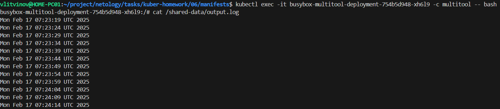
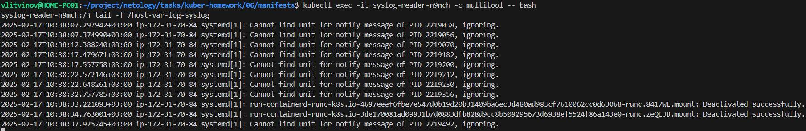

### Задание 1 

**Что нужно сделать**

Создать Deployment приложения, состоящего из двух контейнеров и обменивающихся данными.

1. Создать Deployment приложения, состоящего из контейнеров busybox и multitool.

[deployment.yml](manifests/06/deployment.yml)

2. Сделать так, чтобы busybox писал каждые пять секунд в некий файл в общей директории.

```sh
kubectl apply -f deployment.yml
```

3. Обеспечить возможность чтения файла контейнером multitool.
4. Продемонстрировать, что multitool может читать файл, который периодоически обновляется.

```sh
kubectl exec -it busybox-multitool-deployment-754b5d948-xh6l9 -c multitool -- bash
```

5. Предоставить манифесты Deployment в решении, а также скриншоты или вывод команды из п. 4.



------

### Задание 2

**Что нужно сделать**

Создать DaemonSet приложения, которое может прочитать логи ноды.

1. Создать DaemonSet приложения, состоящего из multitool.

[daemonset.yml](manifests/06/daemonset.yml)

2. Обеспечить возможность чтения файла `/var/log/syslog` кластера MicroK8S.
3. Продемонстрировать возможность чтения файла изнутри пода.

```sh
kubectl exec -it syslog-reader-n9mch -c multitool -- bash
```

4. Предоставить манифесты Deployment, а также скриншоты или вывод команды из п. 2.



------
