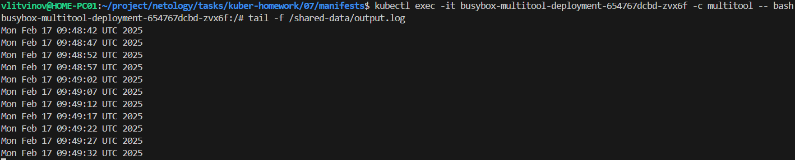
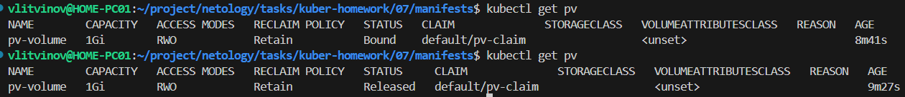
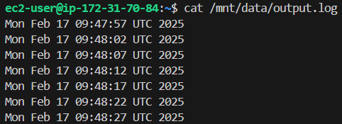
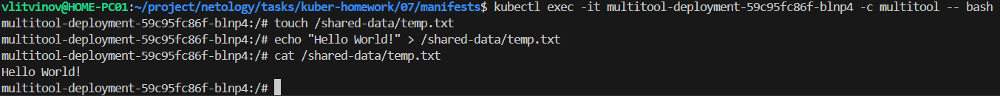

### Задание 1

**Что нужно сделать**

Создать Deployment приложения, использующего локальный PV, созданный вручную.

1. Создать Deployment приложения, состоящего из контейнеров busybox и multitool.

[deployment.yml](manifests/07/deployment.yml)

2. Создать PV и PVC для подключения папки на локальной ноде, которая будет использована в поде.


[pv.yml](manifests/07/pv.yml)

[pvc.yml](manifests/07/pvc.yml)

```sh
kubectl apply -f pv.yml
kubectl apply -f pvc.yml 
kubectl apply -f deployment.yml
```

3. Продемонстрировать, что multitool может читать файл, в который busybox пишет каждые пять секунд в общей директории. 

```sh
kubectl exec -it busybox-multitool-deployment-654767dcbd-zvx6f -c multitool -- bash
```



4. Удалить Deployment и PVC. Продемонстрировать, что после этого произошло с PV. Пояснить, почему.

```sh
kubectl delete -f pvc.yml 
kubectl delete -f deployment.yml
kubectl get pv
```


PV перешёл в статус Released, т.к. по умолчанию политика у PV - Retain (не удаляются автоматически)

5. Продемонстрировать, что файл сохранился на локальном диске ноды. Удалить PV.  Продемонстрировать что произошло с файлом после удаления PV. Пояснить, почему.



```sh
kubectl delete -f pv.yml 
```

После удаления PV файл на диск останется, т.к. политика Reclaim означает, что данные нужно удалить вручную

5. Предоставить манифесты, а также скриншоты или вывод необходимых команд.

------

### Задание 2

**Что нужно сделать**

Создать Deployment приложения, которое может хранить файлы на NFS с динамическим созданием PV.

1. Включить и настроить NFS-сервер на MicroK8S.

```sh 
sudo microk8s enable community
sudo apt install -y nfs-common
microk8s enable nfs
```

2. Создать Deployment приложения состоящего из multitool, и подключить к нему PV, созданный автоматически на сервере NFS.

```sh
kubectl apply -f nfs-pvc.yml
kubectl apply -f nfs-deployment.yml

kubectl exec -it multitool-deployment-59c95fc86f-blnp4 -c multitool -- bash
```

[nfs-pvc.yml](manifests/07/nfs-pvc.yml)

[nfs-deployment.yml](manifests/07/nfs-deployment.yml)

3. Продемонстрировать возможность чтения и записи файла изнутри пода. 



4. Предоставить манифесты, а также скриншоты или вывод необходимых команд.

------
