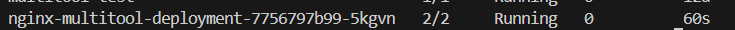
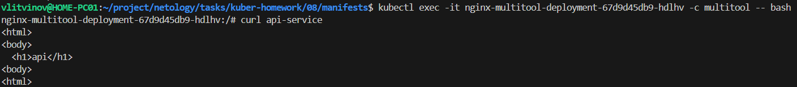
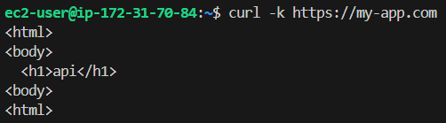

### Задание 1. Создать Deployment приложения и решить возникшую проблему с помощью ConfigMap. Добавить веб-страницу

1. Создать Deployment приложения, состоящего из контейнеров nginx и multitool.

[deployment.yml](manifests/deployment.yml)

2. Решить возникшую проблему с помощью ConfigMap.

[configmap.yml](manifests/configmap.yml)

```sh
kubectl apply -f configmap.yml
kubectl apply -f deployment.yml
```

3. Продемонстрировать, что pod стартовал и оба конейнера работают.



4. Сделать простую веб-страницу и подключить её к Nginx с помощью ConfigMap. Подключить Service и показать вывод curl или в браузере.

[svc.yml](manifests/svc.yml)

```sh
kubectl apply -f configmap.yml
kubectl apply -f deployment.yml
kubectl apply -f svc.yml
```

5. Предоставить манифесты, а также скриншоты или вывод необходимых команд.



------

### Задание 2. Создать приложение с вашей веб-страницей, доступной по HTTPS 

1. Создать Deployment приложения, состоящего из Nginx.

[deployment.yml](manifests/02/deployment.yml)

2. Создать собственную веб-страницу и подключить её как ConfigMap к приложению.

[configmap.yml](manifests/02/configmap.yml)

3. Выпустить самоподписной сертификат SSL. Создать Secret для использования сертификата.

```sh
openssl req -x509 -newkey rsa:4096 -keyout nginx.key -out nginx.crt -days 365 -nodes -subj "/CN=my-app.com"
cat nginx.crt | base64
cat nginx.key | base64

kubectl apply -f secret.yml
```

4. Создать Ingress и необходимый Service, подключить к нему SSL в вид. Продемонстировать доступ к приложению по HTTPS.

[svc.yml](manifests/02/svc.yml)

[ingress.yml](manifests/02/ingress.yml)

```sh
kubectl apply -f svc.yml
kubectl apply -f ingress.yml
```

5. Предоставить манифесты, а также скриншоты или вывод необходимых команд.



------
