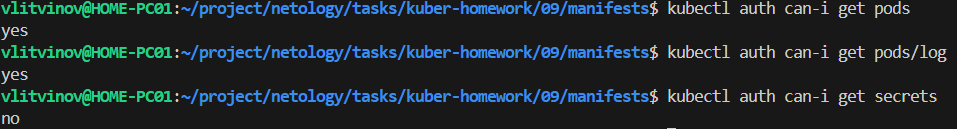

### Задание 1. Создайте конфигурацию для подключения пользователя

1. Создайте и подпишите SSL-сертификат для подключения к кластеру.

```sh
openssl genrsa -out netology.key 2048
openssl req -new -key netology.key -out netology.csr -subj "/CN=netology/O=ops"

scp user@kuberhost:/var/snap/microk8s/current/certs/ca.key .
scp user@kuberhost:/var/snap/microk8s/current/certs/ca.crt .

openssl x509 -req -in netology.csr -CA ca.crt -CAkey ca.key -CAcreateserial -out netology.crt -days 500
```

2. Настройте конфигурационный файл kubectl для подключения.

```sh
kubectl config set-credentials netology --client-certificate=netology.crt --client-key=netology.key --embed-certs=true
kubectl config set-context netology --cluster=microk8s-cluster --user=netology
kubectl config use-context netology
```

3. Создайте роли и все необходимые настройки для пользователя.

```sh
microk8s enable rbac
```

4. Предусмотрите права пользователя. Пользователь может просматривать логи подов и их конфигурацию (`kubectl logs pod <pod_id>`, `kubectl describe pod <pod_id>`).

[role.yml](manifests/role.yml)

[role-binding.yml](manifests/role-binding.yml)

```sh
kubectl config use-context microk8s
kubectl apply -f role.yml
kubectl apply -f role-binding.yml
kubectl config use-context netology
kubectl auth can-i get pods
```

5. Предоставьте манифесты и скриншоты и/или вывод необходимых команд.



------
