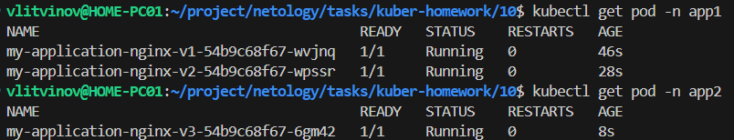

### Задание 1. Подготовить Helm-чарт для приложения

1. Необходимо упаковать приложение в чарт для деплоя в разные окружения. 

```sh
helm create application-chart
```

2. Каждый компонент приложения деплоится отдельным deployment’ом или statefulset’ом.
3. В переменных чарта измените образ приложения для изменения версии.

------
### Задание 2. Запустить две версии в разных неймспейсах

1. Подготовив чарт, необходимо его проверить. Запуститe несколько копий приложения.

```sh
helm template test ./application-chart/
```

2. Одну версию в namespace=app1, вторую версию в том же неймспейсе, третью версию в namespace=app2.

```sh
kubectl create namespace app1
helm install myapp-v1 ./application-chart --namespace app1 --set release_version=v1
helm install myapp-v2 ./application-chart --namespace app1 --set release_version=v2
kubectl create namespace app2
helm install myapp-v3 ./application-chart --namespace app2 --set release_version=v3
```

3. Продемонстрируйте результат.


