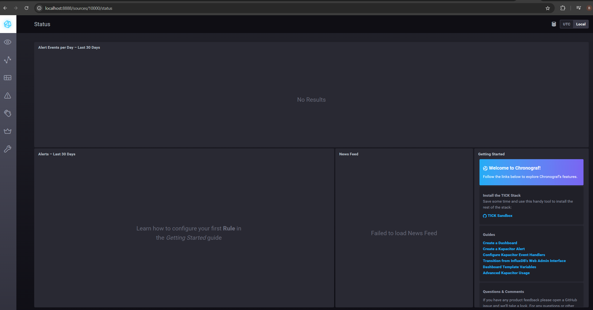
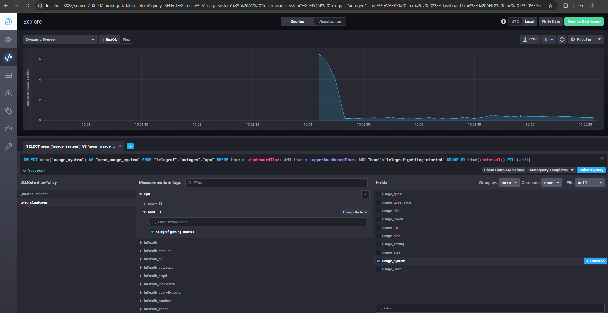

1. Вас пригласили настроить мониторинг на проект. На онбординге вам рассказали, что проект представляет из себя 
платформу для вычислений с выдачей текстовых отчетов, которые сохраняются на диск. Взаимодействие с платформой 
осуществляется по протоколу http. Также вам отметили, что вычисления загружают ЦПУ. Какой минимальный набор метрик вы
выведите в мониторинг и почему?
#
- Мониторинг CPU - т.к. вычисления загружают CPU необходимо отслеживать, что системе достаточно вычислительной мощности. Метрика: загруженность ядер load avarage
- Мониторинг RAM - не возникает ли нехватки памяти, из-за чего могут возникнуть сбои или замедление работы. Метрики: количество свободной и используемой RAM
- Мониторнг дисков - т.к. отчёты сохраняются на диск. Метрики: свободное и занятое место на диске, скорость чтения/записи.
- Мониторинг inodes - т.к. их число конечно и в какой-то момент отчёты могут перстать сохраняться
- Мониторинг Network Interface - т.к. взаимодействие с платформой происходит по http. Метрики: скорость передачи данных (up/down). 
- Мониторинг приложения - Метрики: Response Time, Request Rate, Response Code Ratio.
# 
2. Менеджер продукта посмотрев на ваши метрики сказал, что ему непонятно что такое RAM/inodes/CPUla. Также он сказал, 
что хочет понимать, насколько мы выполняем свои обязанности перед клиентами и какое качество обслуживания. Что вы 
можете ему предложить?
#
RAM - опретавииная память. Её необходимо мониторить, чтобы понимать достачно ли её у приложения
inodes - метафайл, который есть у каждого файла. Если в какой-то момент их количество превысит лимит, мы не сможем сохранить новые отчёты.
CPUla - средняя нагрузка на процессор. Необходимо, чтобы отчёты формировались как можно быстрее, а не ожидали пока осводится ресурс у CPU

Предложу менеджеру разработать SLA (соглашение об уровне обслуживания) для клиентов. Также предложу определить SLI и SLO, которые будут показывать конкретные числа.
#
3. Вашей DevOps команде в этом году не выделили финансирование на построение системы сбора логов. Разработчики в свою 
очередь хотят видеть все ошибки, которые выдают их приложения. Какое решение вы можете предпринять в этой ситуации, 
чтобы разработчики получали ошибки приложения?
#
Разврену систему логирования на opensource-решениях, например ELK (Elasticsearch +  logstash + Kibana)
#
4. Вы, как опытный SRE, сделали мониторинг, куда вывели отображения выполнения SLA=99% по http кодам ответов. 
Вычисляете этот параметр по следующей формуле: summ_2xx_requests/summ_all_requests. Данный параметр не поднимается выше 
70%, но при этом в вашей системе нет кодов ответа 5xx и 4xx. Где у вас ошибка?
#
Возможно не учитываются коды редиректов (3xx). Необходимо изменить формулу:
(summ_2xx_requests+summ_2xx_requests)/summ_all_requests
#
5. Опишите основные плюсы и минусы pull и push систем мониторинга.
#
Плюсы push-модели:
- упрощение репликации данных в разные системы мониторинга или их резервные копии 
- более гибкая настройка отправки пакетов данных с метриками
- UDP — это менее затратный способ передачи данных, из-за чего может возрасти производительность сбора метрик
Минусы push-модели:
- Если настроен push по расписанию, то все хосты могут отправить данные на сервер одновременно.

Плюсы pull-модели:
- легче контролировать подлинность данных
- можно настроить единый proxy server до всех агентов с TLS
- упрощённая отладка получения данных с агентов
Минусы pull-модели:
- Увеличение трафика в сети из-за установки соединений

#
6. Какие из ниже перечисленных систем относятся к push модели, а какие к pull? А может есть гибридные?

    - Prometheus - pull
    - TICK - push
    - Zabbix - гибридная
    - VictoriaMetrics - гибридная
    - Nagios -гибридная
#
7. Склонируйте себе [репозиторий](https://github.com/influxdata/sandbox/tree/master) и запустите TICK-стэк, 
используя технологии docker и docker-compose.

В виде решения на это упражнение приведите скриншот веб-интерфейса ПО chronograf (`http://localhost:8888`). 

P.S.: если при запуске некоторые контейнеры будут падать с ошибкой - проставьте им режим `Z`, например
`./data:/var/lib:Z`
#

#
8. Перейдите в веб-интерфейс Chronograf (http://localhost:8888) и откройте вкладку Data explorer.
        
    - Нажмите на кнопку Add a query
    - Изучите вывод интерфейса и выберите БД telegraf.autogen
    - В `measurments` выберите cpu->host->telegraf-getting-started, а в `fields` выберите usage_system. Внизу появится график утилизации cpu.
    - Вверху вы можете увидеть запрос, аналогичный SQL-синтаксису. Поэкспериментируйте с запросом, попробуйте изменить группировку и интервал наблюдений.

Для выполнения задания приведите скриншот с отображением метрик утилизации cpu из веб-интерфейса.
#

#
9. Изучите список [telegraf inputs](https://github.com/influxdata/telegraf/tree/master/plugins/inputs). 
Добавьте в конфигурацию telegraf следующий плагин - [docker](https://github.com/influxdata/telegraf/tree/master/plugins/inputs/docker):
#
Метрики Docker уже подключены с помощью секции
```
[[inputs.docker]]
  endpoint = "unix:///var/run/docker.sock"
  container_names = []
  timeout = "5s"
  perdevice = true
  total = false
```
#
