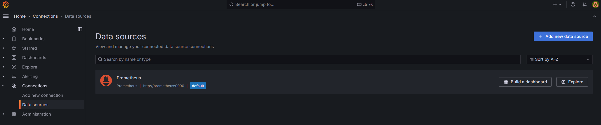
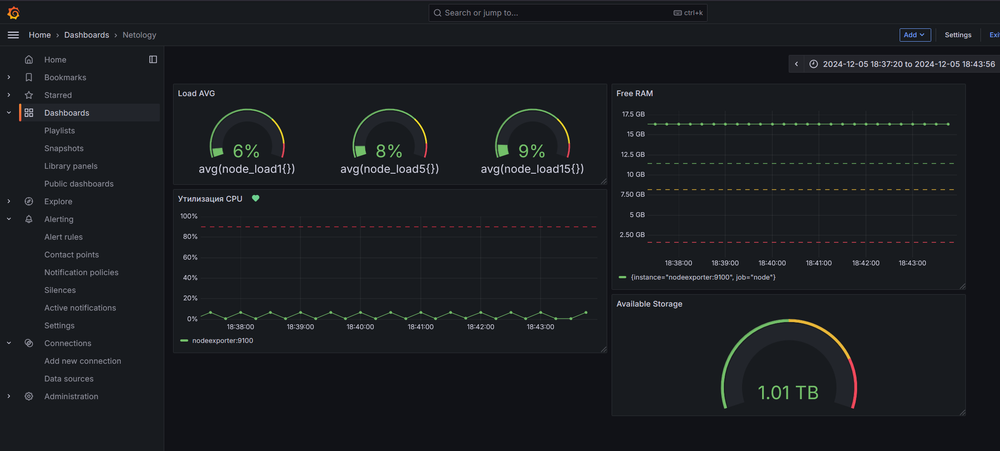
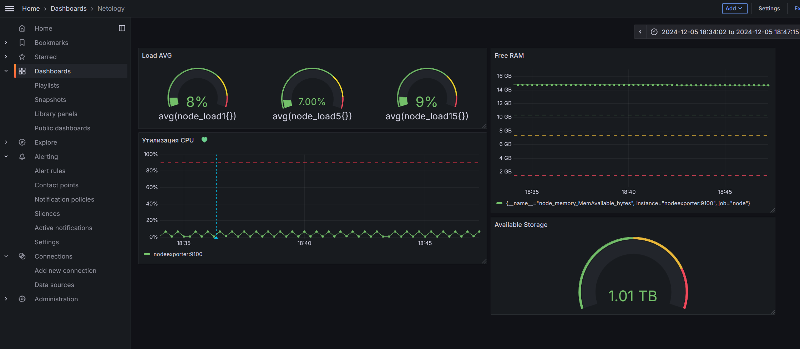

# Домашнее задание к занятию 14 «Средство визуализации Grafana»

docker-compose.yml для развёртывания инфраструктуры находится в директории infra. Подготовить инфраструктуру?
```
docker compose up -d
```
## Обязательные задания

### Задание 1
Datasource подключается автоматически через использование манифеста `infra/grafana/datasource.yml`


## Задание 2

Создайте Dashboard и в ней создайте Panels:

- утилизация CPU для nodeexporter (в процентах, 100-idle);
```
100 * (1 - avg by(instance)(irate(node_cpu_seconds_total{mode="idle"}[1m])))
```
- CPULA 1/5/15;
```
avg(node_load1{})
avg(node_load5{})
avg(node_load15{})
```
- количество свободной оперативной памяти;
```
node_memory_MemAvailable_bytes
```
- количество места на файловой системе.
```
node_filesystem_avail_bytes{mountpoint="/"}
```



## Задание 3



## Задание 4

Листинг этого файла находится в `monitoring-homework/02/dashboard.json`
