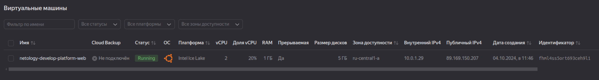
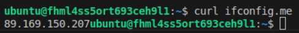
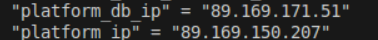

### Задание 1

Допущена ошибка в ресурсе "yandex_compute_instance" "platform". Нет платформы типа standart-v4, можно  standard-v3;

core_fraction = 5, Для платформы standard-v3 возможные значения 20, 50, 100

Для платформы standard-v3 cores не может быть равен 1, только 2 или 4




Параметры ```preemptible = true``` и ```core_fraction=5``` позволят снизить стоимость VM в облаке.


### Задание 2

```
###instance_vars

variable "vm_web_image_families" {
  type        = string
  default     = "ubuntu-2004-lts"
  description = "Image OS-families"
}

variable "vm_web_instance_name" {
  type        = string
  default     = "netology-develop-platform-web"
  description = "Instance name"
}

variable "vm_web_platform_id" {
  type        = string
  default     = "standard-v3"
  description = "Platforms ID"
}
```

```
data "yandex_compute_image" "ubuntu" {
  family = var.vm_web_image_families
}
resource "yandex_compute_instance" "platform" {
  name        = var.vm_web_instance_name
  platform_id = var.vm_web_platform_id
  resources {...}
```

### Задание 3

