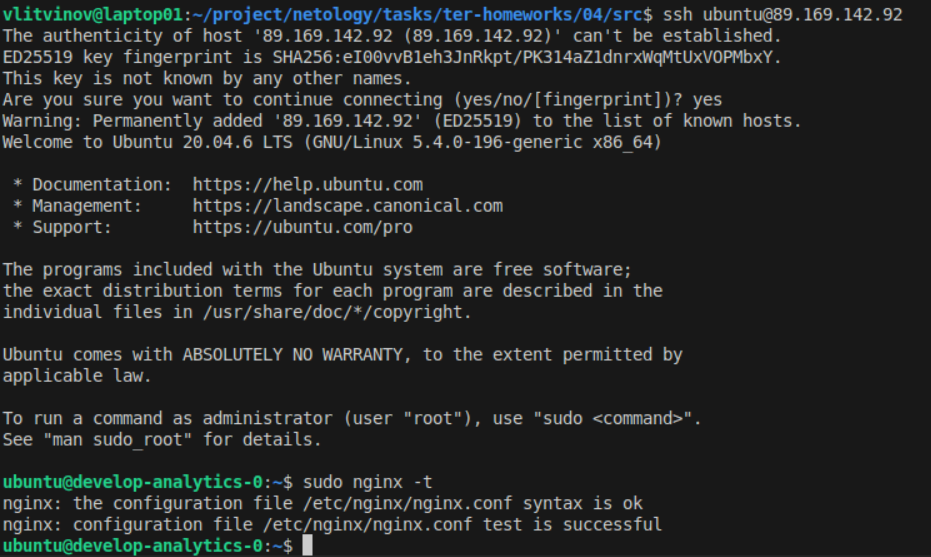
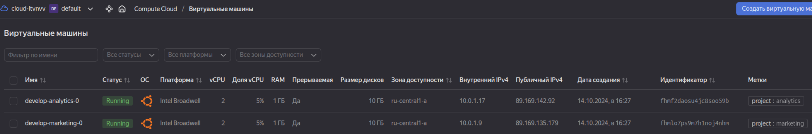
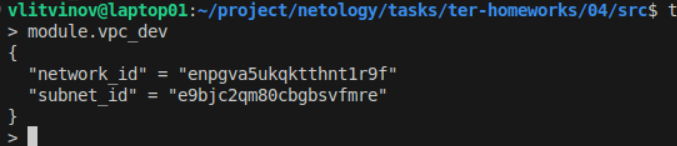
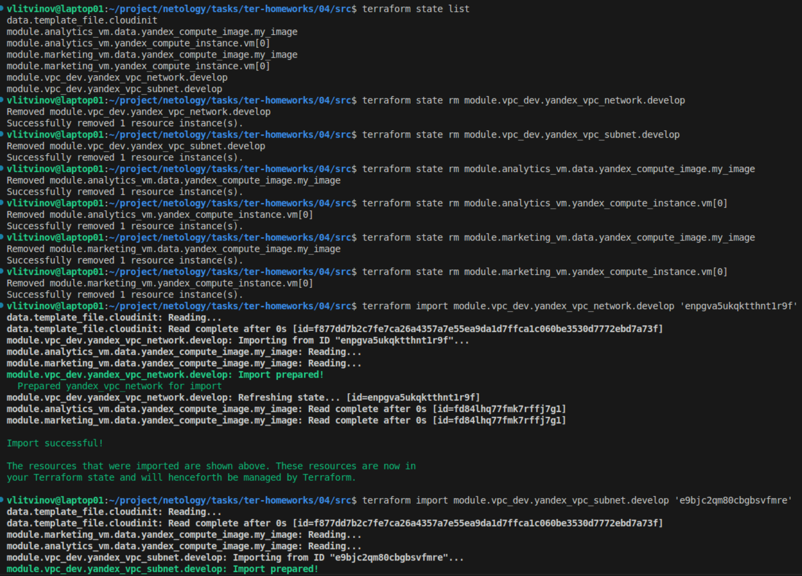

### Задание 1





```
vlitvinov@laptop01:~/project/netology/tasks/ter-homeworks/04/src$ terraform console
> module.marketing_vm
{
  "external_ip_address" = [
    "89.169.135.179",
  ]
  "fqdn" = [
    "develop-marketing-0.ru-central1.internal",
  ]
  "internal_ip_address" = [
    "10.0.1.9",
  ]
  "labels" = [
    tomap({
      "project" = "marketing"
    }),
  ]
  "network_interface" = [
    tolist([
      {
        "dns_record" = tolist([])
        "index" = 0
        "ip_address" = "10.0.1.9"
        "ipv4" = true
        "ipv6" = false
        "ipv6_address" = ""
        "ipv6_dns_record" = tolist([])
        "mac_address" = "d0:0d:15:c1:f3:c4"
        "nat" = true
        "nat_dns_record" = tolist([])
        "nat_ip_address" = "89.169.135.179"
        "nat_ip_version" = "IPV4"
        "security_group_ids" = toset([])
        "subnet_id" = "e9bp7timmfgtq0nt2fgf"
      },
    ]),
  ]
}
```

### Задание 2



## Requirements

| Name | Version |
|------|---------|
| <a name="requirement_terraform"></a> [terraform](#requirement\_terraform) | ~>1.8.4 |

## Providers

| Name | Version |
|------|---------|
| <a name="provider_yandex"></a> [yandex](#provider\_yandex) | n/a |

## Modules

No modules.

## Resources

| Name | Type |
|------|------|
| [yandex_vpc_network.develop](https://registry.terraform.io/providers/yandex-cloud/yandex/latest/docs/resources/vpc_network) | resource |
| [yandex_vpc_subnet.develop](https://registry.terraform.io/providers/yandex-cloud/yandex/latest/docs/resources/vpc_subnet) | resource |

## Inputs

| Name | Description | Type | Default | Required |
|------|-------------|------|---------|:--------:|
| <a name="input_cidr"></a> [cidr](#input\_cidr) | https://cloud.yandex.ru/docs/vpc/operations/subnet-create | `list(string)` | <pre>[<br/>  "10.0.1.0/24"<br/>]</pre> | no |
| <a name="input_env_name"></a> [env\_name](#input\_env\_name) | VPC network&subnet name | `string` | `"develop"` | no |
| <a name="input_zone"></a> [zone](#input\_zone) | https://cloud.yandex.ru/docs/overview/concepts/geo-scope | `string` | `"ru-central1-a"` | no |

## Outputs

| Name | Description |
|------|-------------|
| <a name="output_network_id"></a> [network\_id](#output\_network\_id) | n/a |
| <a name="output_subnet_id"></a> [subnet\_id](#output\_subnet\_id) | n/a |


### Задание 2



```
vlitvinov@laptop01:~/project/netology/tasks/ter-homeworks/04/src$ terraform state list
data.template_file.cloudinit
module.analytics_vm.data.yandex_compute_image.my_image
module.analytics_vm.yandex_compute_instance.vm[0]
module.marketing_vm.data.yandex_compute_image.my_image
module.marketing_vm.yandex_compute_instance.vm[0]
module.vpc_dev.yandex_vpc_network.develop
module.vpc_dev.yandex_vpc_subnet.develop
vlitvinov@laptop01:~/project/netology/tasks/ter-homeworks/04/src$ terraform state rm module.vpc_dev.yandex_vpc_network.develop
Removed module.vpc_dev.yandex_vpc_network.develop
Successfully removed 1 resource instance(s).
vlitvinov@laptop01:~/project/netology/tasks/ter-homeworks/04/src$ terraform state rm module.vpc_dev.yandex_vpc_subnet.develop
Removed module.vpc_dev.yandex_vpc_subnet.develop
Successfully removed 1 resource instance(s).
vlitvinov@laptop01:~/project/netology/tasks/ter-homeworks/04/src$ terraform state rm module.analytics_vm.data.yandex_compute_image.my_image
Removed module.analytics_vm.data.yandex_compute_image.my_image
Successfully removed 1 resource instance(s).
vlitvinov@laptop01:~/project/netology/tasks/ter-homeworks/04/src$ terraform state rm module.analytics_vm.yandex_compute_instance.vm[0]
Removed module.analytics_vm.yandex_compute_instance.vm[0]
Successfully removed 1 resource instance(s).
vlitvinov@laptop01:~/project/netology/tasks/ter-homeworks/04/src$ terraform state rm module.marketing_vm.data.yandex_compute_image.my_image
Removed module.marketing_vm.data.yandex_compute_image.my_image
Successfully removed 1 resource instance(s).
vlitvinov@laptop01:~/project/netology/tasks/ter-homeworks/04/src$ terraform state rm module.marketing_vm.yandex_compute_instance.vm[0]
Removed module.marketing_vm.yandex_compute_instance.vm[0]
Successfully removed 1 resource instance(s).
vlitvinov@laptop01:~/project/netology/tasks/ter-homeworks/04/src$ terraform import module.vpc_dev.yandex_vpc_network.develop 'enpgva5ukqktthnt1r9f'
data.template_file.cloudinit: Reading...
data.template_file.cloudinit: Read complete after 0s [id=f877dd7b2c7fe7ca26a4357a7e55ea9da1d7ffca1c060be3530d7772ebd7a73f]
module.vpc_dev.yandex_vpc_network.develop: Importing from ID "enpgva5ukqktthnt1r9f"...
module.analytics_vm.data.yandex_compute_image.my_image: Reading...
module.marketing_vm.data.yandex_compute_image.my_image: Reading...
module.vpc_dev.yandex_vpc_network.develop: Import prepared!
  Prepared yandex_vpc_network for import
module.vpc_dev.yandex_vpc_network.develop: Refreshing state... [id=enpgva5ukqktthnt1r9f]
module.analytics_vm.data.yandex_compute_image.my_image: Read complete after 0s [id=fd84lhq77fmk7rffj7g1]
module.marketing_vm.data.yandex_compute_image.my_image: Read complete after 0s [id=fd84lhq77fmk7rffj7g1]

Import successful!

The resources that were imported are shown above. These resources are now in
your Terraform state and will henceforth be managed by Terraform.

vlitvinov@laptop01:~/project/netology/tasks/ter-homeworks/04/src$ terraform import module.vpc_dev.yandex_vpc_subnet.develop 'e9bjc2qm80cbgbsvfmre'
data.template_file.cloudinit: Reading...
data.template_file.cloudinit: Read complete after 0s [id=f877dd7b2c7fe7ca26a4357a7e55ea9da1d7ffca1c060be3530d7772ebd7a73f]
module.marketing_vm.data.yandex_compute_image.my_image: Reading...
module.analytics_vm.data.yandex_compute_image.my_image: Reading...
module.vpc_dev.yandex_vpc_subnet.develop: Importing from ID "e9bjc2qm80cbgbsvfmre"...
module.vpc_dev.yandex_vpc_subnet.develop: Import prepared!
  Prepared yandex_vpc_subnet for import
module.vpc_dev.yandex_vpc_subnet.develop: Refreshing state... [id=e9bjc2qm80cbgbsvfmre]
module.analytics_vm.data.yandex_compute_image.my_image: Read complete after 1s [id=fd84lhq77fmk7rffj7g1]
module.marketing_vm.data.yandex_compute_image.my_image: Read complete after 1s [id=fd84lhq77fmk7rffj7g1]

Import successful!

The resources that were imported are shown above. These resources are now in
your Terraform state and will henceforth be managed by Terraform.

vlitvinov@laptop01:~/project/netology/tasks/ter-homeworks/04/src$ terraform import module.analytics_vm.yandex_compute_instance.vm[0] 'fhmpjj8f9q6a2e7e7v53'
data.template_file.cloudinit: Reading...
data.template_file.cloudinit: Read complete after 0s [id=f877dd7b2c7fe7ca26a4357a7e55ea9da1d7ffca1c060be3530d7772ebd7a73f]
module.marketing_vm.data.yandex_compute_image.my_image: Reading...
module.analytics_vm.data.yandex_compute_image.my_image: Reading...
module.marketing_vm.data.yandex_compute_image.my_image: Read complete after 0s [id=fd84lhq77fmk7rffj7g1]
module.analytics_vm.data.yandex_compute_image.my_image: Read complete after 0s [id=fd84lhq77fmk7rffj7g1]
module.analytics_vm.yandex_compute_instance.vm[0]: Importing from ID "fhmpjj8f9q6a2e7e7v53"...
module.analytics_vm.yandex_compute_instance.vm[0]: Import prepared!
  Prepared yandex_compute_instance for import
module.analytics_vm.yandex_compute_instance.vm[0]: Refreshing state... [id=fhmpjj8f9q6a2e7e7v53]

Import successful!

The resources that were imported are shown above. These resources are now in
your Terraform state and will henceforth be managed by Terraform.

vlitvinov@laptop01:~/project/netology/tasks/ter-homeworks/04/src$ terraform import module.marketing_vm.yandex_compute_instance.vm[0] 'fhmnk72lmjofusofttq3'
data.template_file.cloudinit: Reading...
data.template_file.cloudinit: Read complete after 0s [id=f877dd7b2c7fe7ca26a4357a7e55ea9da1d7ffca1c060be3530d7772ebd7a73f]
module.analytics_vm.data.yandex_compute_image.my_image: Reading...
module.marketing_vm.data.yandex_compute_image.my_image: Reading...
module.marketing_vm.data.yandex_compute_image.my_image: Read complete after 0s [id=fd84lhq77fmk7rffj7g1]
module.marketing_vm.yandex_compute_instance.vm[0]: Importing from ID "fhmnk72lmjofusofttq3"...
module.analytics_vm.data.yandex_compute_image.my_image: Read complete after 0s [id=fd84lhq77fmk7rffj7g1]
module.marketing_vm.yandex_compute_instance.vm[0]: Import prepared!
  Prepared yandex_compute_instance for import
module.marketing_vm.yandex_compute_instance.vm[0]: Refreshing state... [id=fhmnk72lmjofusofttq3]

Import successful!

The resources that were imported are shown above. These resources are now in
your Terraform state and will henceforth be managed by Terraform.

vlitvinov@laptop01:~/project/netology/tasks/ter-homeworks/04/src$ terraform plan
data.template_file.cloudinit: Reading...
data.template_file.cloudinit: Read complete after 0s [id=f877dd7b2c7fe7ca26a4357a7e55ea9da1d7ffca1c060be3530d7772ebd7a73f]
module.marketing_vm.data.yandex_compute_image.my_image: Reading...
module.analytics_vm.data.yandex_compute_image.my_image: Reading...
module.vpc_dev.yandex_vpc_network.develop: Refreshing state... [id=enpgva5ukqktthnt1r9f]
module.analytics_vm.data.yandex_compute_image.my_image: Read complete after 0s [id=fd84lhq77fmk7rffj7g1]
module.marketing_vm.data.yandex_compute_image.my_image: Read complete after 0s [id=fd84lhq77fmk7rffj7g1]
module.vpc_dev.yandex_vpc_subnet.develop: Refreshing state... [id=e9bjc2qm80cbgbsvfmre]
module.marketing_vm.yandex_compute_instance.vm[0]: Refreshing state... [id=fhmnk72lmjofusofttq3]
module.analytics_vm.yandex_compute_instance.vm[0]: Refreshing state... [id=fhmpjj8f9q6a2e7e7v53]

Terraform used the selected providers to generate the following execution plan. Resource actions are indicated with the following symbols:
  ~ update in-place

Terraform will perform the following actions:

  # module.analytics_vm.yandex_compute_instance.vm[0] will be updated in-place
  ~ resource "yandex_compute_instance" "vm" {
      + allow_stopping_for_update = true
        id                        = "fhmpjj8f9q6a2e7e7v53"
        name                      = "develop-analytics-0"
        # (15 unchanged attributes hidden)

        # (6 unchanged blocks hidden)
    }

  # module.marketing_vm.yandex_compute_instance.vm[0] will be updated in-place
  ~ resource "yandex_compute_instance" "vm" {
      + allow_stopping_for_update = true
        id                        = "fhmnk72lmjofusofttq3"
        name                      = "develop-marketing-0"
        # (15 unchanged attributes hidden)

        # (6 unchanged blocks hidden)
    }

Plan: 0 to add, 2 to change, 0 to destroy.

─────────────────────────────────────────────────────────────────────────────────────────────────────────────────────────────────────────────────────────────────────────────────────────────────────────

Note: You didn't use the -out option to save this plan, so Terraform can't guarantee to take exactly these actions if you run "terraform apply" now.
vlitvinov@laptop01:~/project/netology/tasks/ter-homeworks/04/src$ 
```